# Contributing Translations

This document details the intended workflow for translations of various text. The instructions assume you have access to contribute to the repository. It is still possible to submit pull requests without the ability to directly write to the repository, but it won't be possible to run the actions on the branch itself.

Content to be translated is broken up into several different categories:
* Text centralized within spreadsheets (XLSX files)
* Text inlined within the game's scripts
* Graphics in the form of tilesets that may have an associated tilemap

## Spreadsheets

While it's entirely possible to manage the spreadsheet file locally on your machine with Git, the following steps rely on automation and scripts such that everything can be handled by downloading and uploading the spreadsheet file without needing to do any local setup beyond modifying the spreadsheet itself.

The steps below outline what is necessary to create an entirely new set of changes from scratch, but if iterating on previous work, just skip to step 8.

1. Obtain the latest XLSX file. For example for gamescene_npc, it can be found in [game/text/](game/text/gamescene_npc.xlsx)
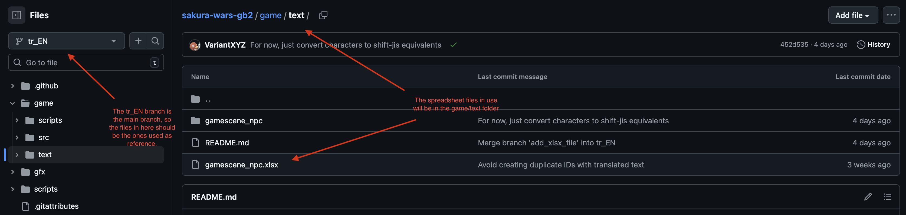
--
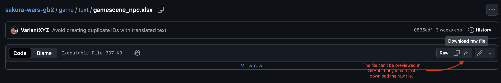
2. Make changes locally to the XLSX as necessary, make sure to read [this README](game/text/README.md) file and avoid making changes to read-only columns.
3. In the GitHub web interface, navigate to the folder with the spreadsheet (similar to step 1).
4. In the top-right, click the 'Add File' drop down and select **Upload files**. Make sure the branch on the left side is the translation branch and that the file name of your xlsx file matches the one in the folder.
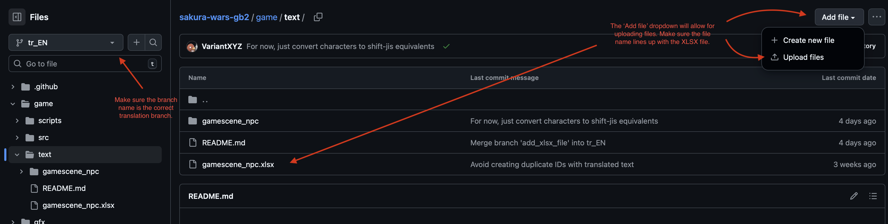
5. Drag or manually select the xlsx file, make sure the name is not changed (avoid any numeric suffixes that might've been added).
6. Under the **Commit Changes** section, feel free to add a description of the changes to make it more descriptive. Make sure the **Create a new branch for this commit and start a pull request.** radio button is selected. The branch name can remain unchanged, or can be given some descriptive name.
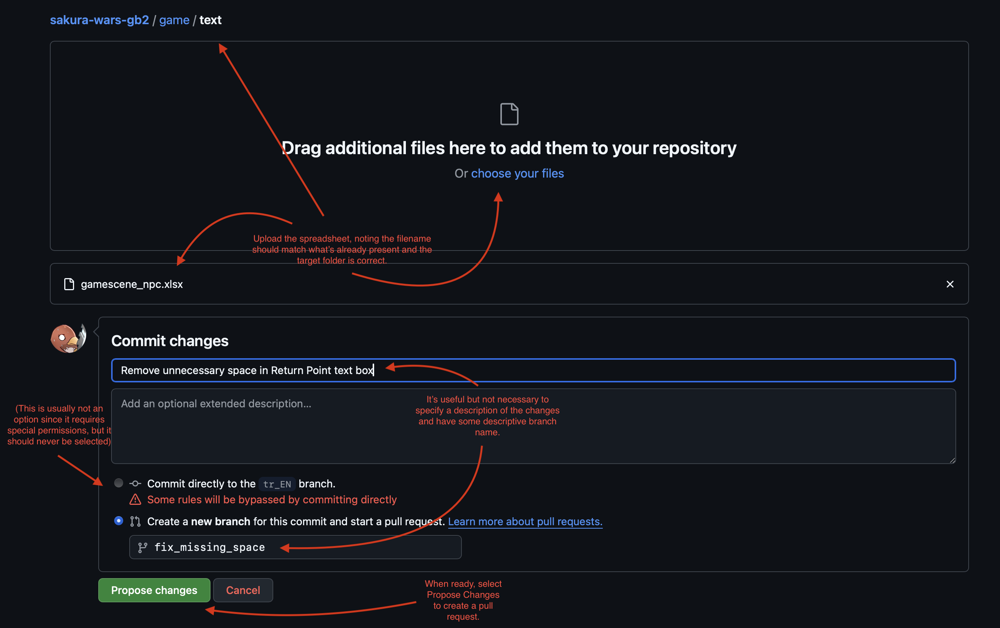
7. Selecting **Propose Changes** will bring you to the **Open a pull request** page. Nothing should need to be changed, but feel free to update the description or title if desired. When ready, press the **Create pull request** button.
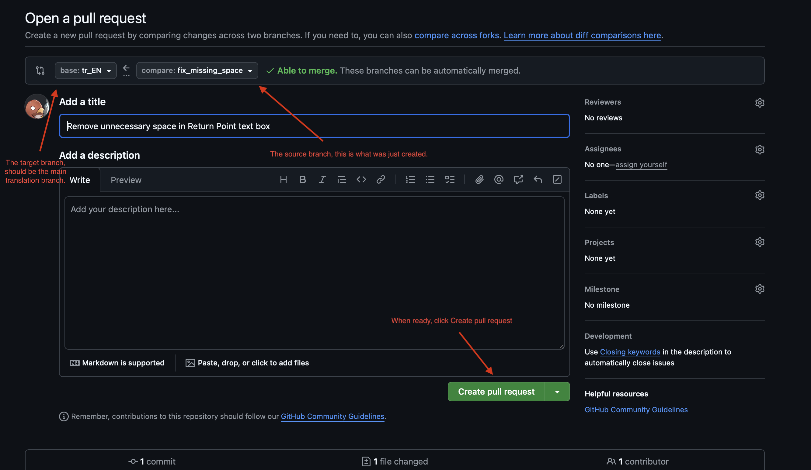
8. You should be taken to the Pull Request automatically, but if not (or you need to navigate back to it), it will be under the [Pull Requests](https://github.com/VariantXYZ/sakura-wars-gb2/pulls) tab at the top.
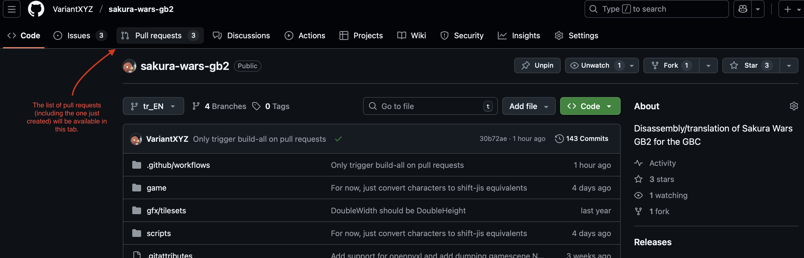
--
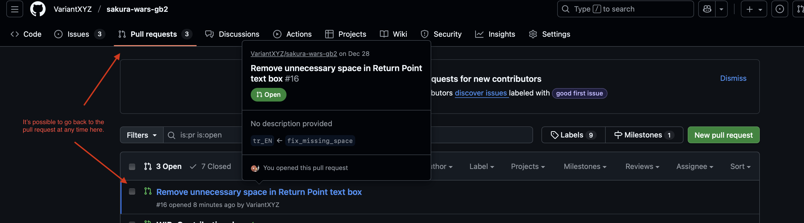
9. The changes to xlsx files will automatically trigger a job to update the CSVs from the spreadsheets. It's possible to see the file changes. 
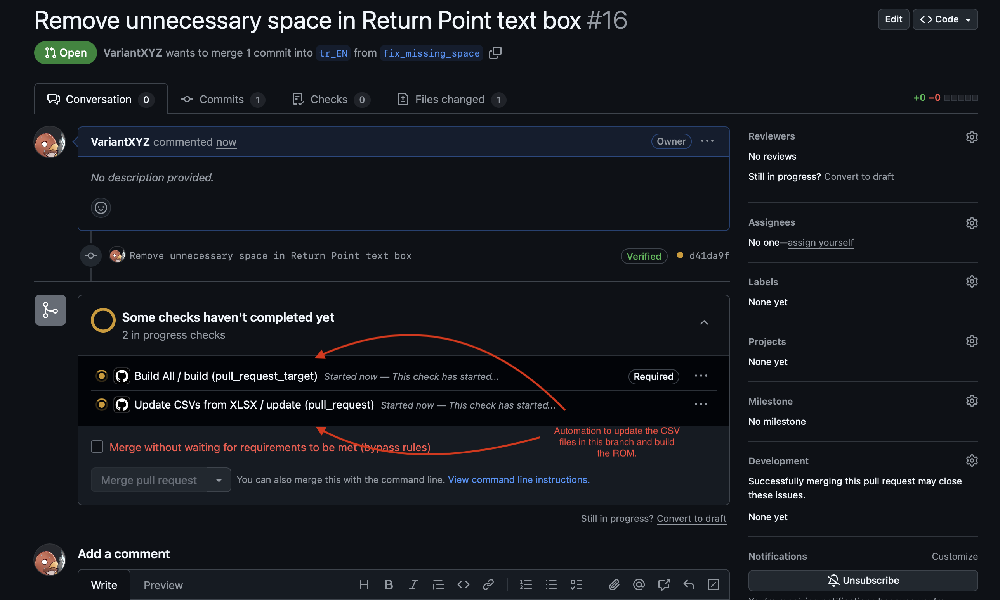
--
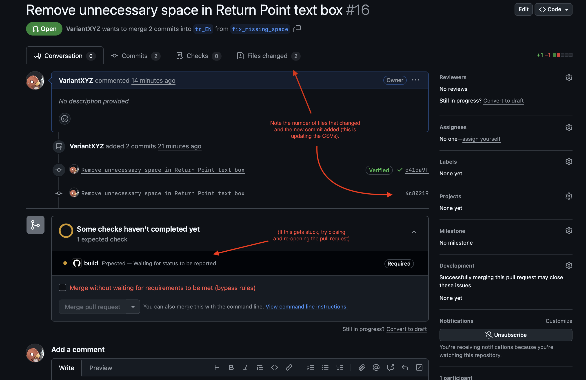
--
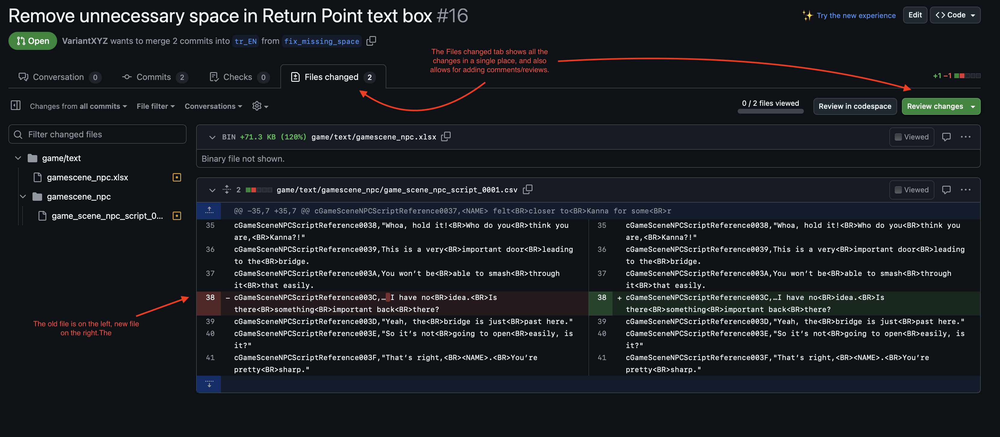
10. At this stage, a branch for all the changes and pull request has been created and so it's only necessary to upload new spreadsheets to iterate changes (up until the pull request is finally merged into the translation branch). To do so, simply follow steps 4 through 6 except target your new branch and don't create a new request. Reference the images below.
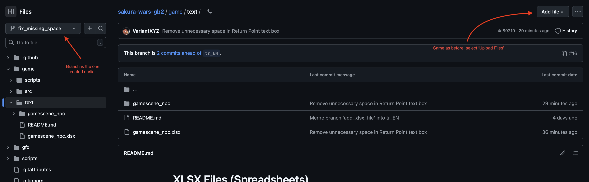
--
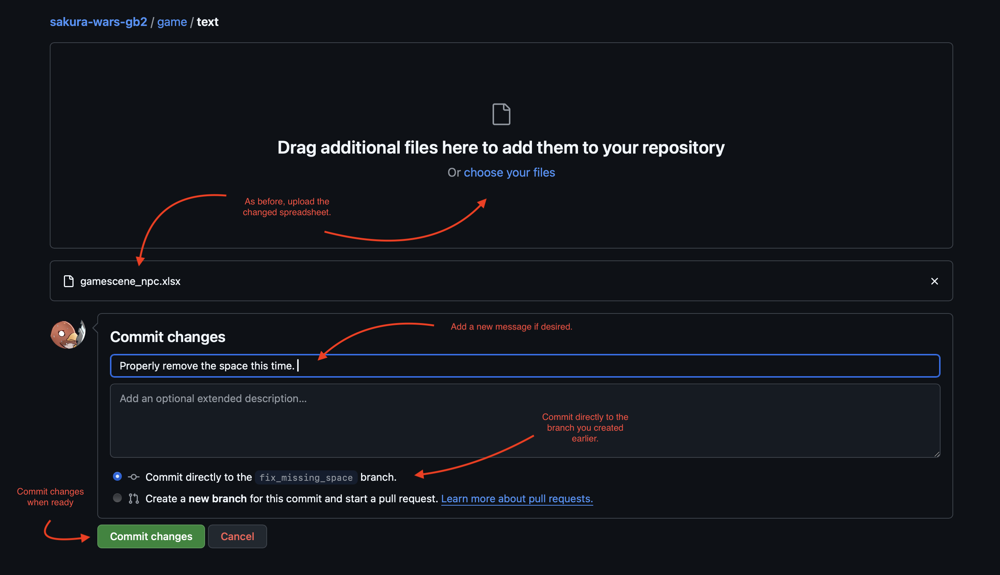
--
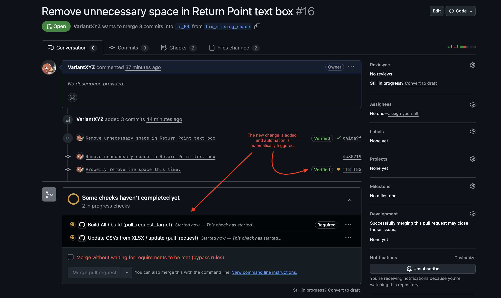
--
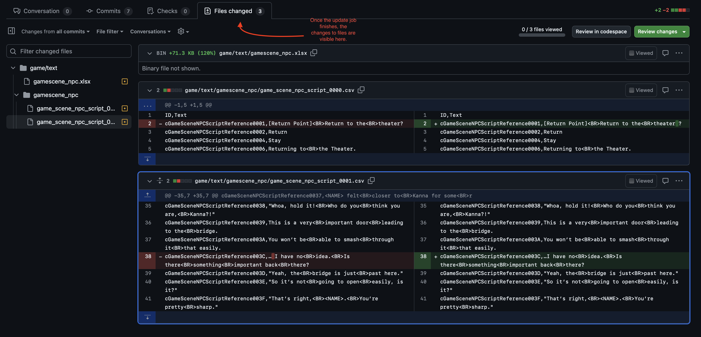
11. After all iteration and review is done, the pull request can be merged (if you see `build Expected — Waiting for status to be reported`, close and re-open the pull request with the button at the bottom.
--
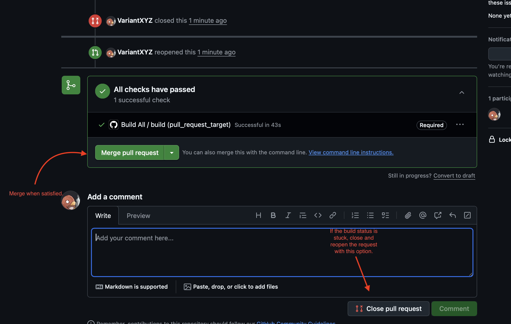

## Script Text

(TBD)

## Graphics

(TBD)